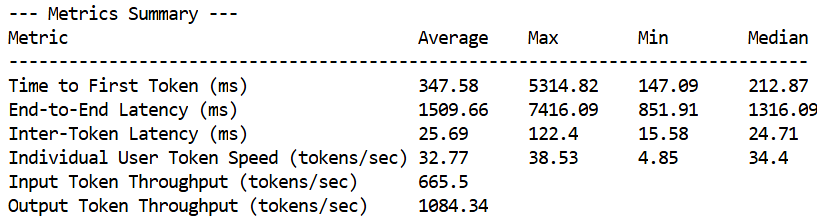

# Deka LLM Load Test

A script to load test Deka LLM API to measure Time to First Token (TTFT) and Token per Second (TPS)

## Installation

Run the following command:

`pip install -r requirements.txt`

## How to Use

1. Change line 18 in `locustfile-llm.py` to the model name you want to test.
2. Change line 21 in `locustfile-llm.py` with the official name of the model in Huggingface to import the correct tokenizer.
3. Change line 26 in `locustfile-llm.py` with the number of concurrent users you want to test.
4. Change line 28 in `locustfile-llm.py` with the prompt you want to test.
5. Run the following bash command: `export HF_TOKEN="[YOUR_HUGGINGFACE_TOKEN]"`. You can get your huggingface token by following this [tutorial](https://huggingface.co/docs/hub/security-tokens).
6. Run the following bash command: `export DEKALLM_API_KEY="[YOUR_DEKALLM_API_KEY]"`.
7. Run the following bash command: `bash run.sh`.

## Result

Below is a sample of a load test result with the script in this repository. We can check the measured value of Time to First Token, End-to-End-Latency, Inter-Token-Latency, Token/sec, Input Token Throughput, and Output Token Throughput in this result.

